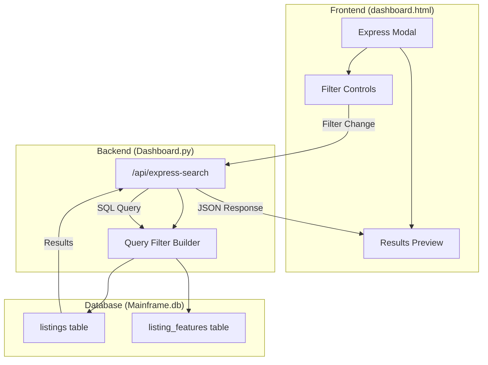

# Design Document: Express Modal Filtering

## Overview

This design document describes the architecture and implementation approach for enhancing the Express Search Modal in the RealAgent Dashboard. The enhancement adds database-backed filtering capabilities, allowing users to filter properties using dropdowns and checklists, with results queried from the SQLite database and displayed as previews within the modal.

The key improvements include:
- Server-side filtering via a new API endpoint
- Dynamic feature filters based on property type
- Real-time results preview within the modal
- Bilingual support (Romanian/Russian)
- Integration with the main dashboard filtering

## Architecture



## Components and Interfaces

### 1. Express Search API Endpoint

**Location:** `Dashboard.py`

**Endpoint:** `POST /api/express-search`

**Request Body:**
```json
{
  "property_type": "apartment|house|commercial",
  "listing_type": "for_sale|for_rent",
  "price_min": 0,
  "price_max": 1000000,
  "features": {
    "feature_numar_camere": "2",
    "feature_stare_apartament": "Reparație euro"
  },
  "limit": 5,
  "offset": 0
}
```

**Response:**
```json
{
  "success": true,
  "total_count": 15,
  "listings": [
    {
      "id": "102312333",
      "title_ro": "Apartament 2 camere",
      "title_ru": "Квартира 2 комнаты",
      "address": "str. Stefan cel Mare 123",
      "display_price": "50,000 €",
      "price_numeric": 50000,
      "first_image": "images/image_0.webp",
      "property_type": "apartment",
      "listing_type": "for_sale"
    }
  ]
}
```

### 2. Query Filter Builder

**Location:** `Dashboard.py` (new function)

**Function:** `build_express_query(filters: dict) -> tuple[str, list]`

Constructs a parameterized SQL query based on the provided filters. Returns the SQL string and parameter list.

**Query Structure:**
```sql
SELECT DISTINCT
    l.id,
    l.title_ro,
    l.title_ru,
    l.address,
    l.price_json,
    l.property_type,
    l.listing_type,
    (SELECT local_path FROM listing_images 
     WHERE listing_id = l.id 
     ORDER BY position LIMIT 1) as first_image
FROM listings l
LEFT JOIN listing_features lf ON l.id = lf.listing_id
WHERE l.status = 'active'
  AND l.property_type = ?
  AND l.listing_type = ?
  AND (price_numeric BETWEEN ? AND ?)
  -- Dynamic feature conditions added here
ORDER BY l.created_at DESC
LIMIT ? OFFSET ?
```

### 3. Frontend Filter State Manager

**Location:** `Templates/Dashboard/dashboard.html` (JavaScript)

**State Variables:**
```javascript
let expressState = {
    propertyType: 'apartment',
    listingType: 'for_sale',
    priceMin: 0,
    priceMax: 1000000,
    features: {},
    results: [],
    totalCount: 0,
    isLoading: false,
    error: null
};
```

**Key Functions:**
- `fetchExpressResults()` - Sends API request with current filters
- `updateExpressPreview(results, totalCount)` - Updates the preview UI
- `debounce(fn, delay)` - Debounces filter changes to prevent excessive API calls

### 4. Feature Filter Configuration

**Location:** `Templates/Dashboard/dashboard.html` (JavaScript)

The existing `expressPropertyFeatures` object defines available filters per property type. This will be enhanced to support database-driven options.

```javascript
const expressPropertyFeatures = {
    apartment: [
        {name: 'feature_numar_camere', type: 'select', options: [...]},
        {name: 'feature_compartimentare', type: 'select', options: [...]},
        // ... more features
    ],
    house: [...],
    commercial: [...]
};
```

## Data Models

### Filter Request Model

| Field | Type | Required | Description |
|-------|------|----------|-------------|
| property_type | string | Yes | One of: apartment, house, commercial |
| listing_type | string | Yes | One of: for_sale, for_rent |
| price_min | number | No | Minimum price (default: 0) |
| price_max | number | No | Maximum price (default: 1000000) |
| features | object | No | Key-value pairs of feature filters |
| limit | number | No | Max results to return (default: 5) |
| offset | number | No | Pagination offset (default: 0) |

### Filter Response Model

| Field | Type | Description |
|-------|------|-------------|
| success | boolean | Whether the query succeeded |
| total_count | number | Total matching listings (before limit) |
| listings | array | Array of listing preview objects |
| error | string | Error message if success is false |

### Listing Preview Model

| Field | Type | Description |
|-------|------|-------------|
| id | string | Listing ID |
| title_ro | string | Romanian title |
| title_ru | string | Russian title |
| address | string | Property address |
| display_price | string | Formatted price string |
| price_numeric | number | Numeric price for sorting |
| first_image | string | Path to first image |
| property_type | string | Property type |
| listing_type | string | Listing type |

## Correctness Properties

*A property is a characteristic or behavior that should hold true across all valid executions of a system-essentially, a formal statement about what the system should do. Properties serve as the bridge between human-readable specifications and machine-verifiable correctness guarantees.*

Based on the prework analysis, the following correctness properties must be maintained:

### Property 1: Feature filters match property type

*For any* property type selection, the feature filters displayed in the Express Modal should be a subset of the predefined features for that property type, and no features from other property types should be shown.

**Validates: Requirements 1.2**

### Property 2: Database query returns only matching results

*For any* combination of filter criteria (property type, listing type, price range, and feature values), all returned listings must satisfy ALL specified filter conditions. Specifically:
- Every returned listing's property_type must equal the selected property type
- Every returned listing's listing_type must equal the selected listing type
- Every returned listing's price_numeric must be >= price_min AND <= price_max
- For each feature filter with a non-empty value, the listing must have that feature with the matching value

**Validates: Requirements 1.4, 2.2, 4.2**

### Property 3: Price slider min/max invariant

*For any* adjustment to the price slider controls, the minimum value must be less than or equal to the maximum value. The system must enforce this constraint and prevent invalid states.

**Validates: Requirements 2.3**

### Property 4: Preview count behavior

*For any* filter result with N matching listings:
- If N > 0, the preview should display exactly min(N, 5) listing items
- If N > 5, a count indicator should display showing (N - 5) additional matches
- If N == 0, no listing items should be displayed

**Validates: Requirements 3.1, 3.3**

### Property 5: Preview items contain required information

*For any* listing displayed in the preview, the rendered HTML must contain:
- An image element with the listing's first_image as source
- The listing's title (in current language)
- The listing's address
- The listing's display_price

**Validates: Requirements 3.2**

### Property 6: Language-specific title display

*For any* listing in the preview and any language setting (ro or ru), the displayed title must match the corresponding language field (title_ro for Romanian, title_ru for Russian). If the language-specific title is empty, fall back to the other language's title.

**Validates: Requirements 6.2**

## Error Handling

### API Error Handling

| Error Condition | HTTP Status | Response | UI Behavior |
|-----------------|-------------|----------|-------------|
| Invalid property_type | 400 | `{"success": false, "error": "Invalid property type"}` | Show error toast, keep previous results |
| Invalid listing_type | 400 | `{"success": false, "error": "Invalid listing type"}` | Show error toast, keep previous results |
| Database error | 500 | `{"success": false, "error": "Database error"}` | Show error toast, keep previous results |
| Network timeout | - | - | Show "Connection error" message, retry button |

### Frontend Error Handling

- **Debounce API calls:** Prevent excessive requests during rapid filter changes (300ms debounce)
- **Loading state:** Show loading indicator during API requests
- **Graceful degradation:** If API fails, maintain previous results and show error message
- **Input validation:** Validate price inputs before sending to API

## Testing Strategy

### Property-Based Testing

The implementation will use **Hypothesis** (Python) for property-based testing of the backend API and query builder.

**Test Configuration:**
- Minimum 100 iterations per property test
- Custom strategies for generating valid filter combinations
- Shrinking enabled to find minimal failing examples

**Property Tests to Implement:**

1. **Query correctness property test**
   - Generate random filter combinations
   - Execute query and verify all results match all criteria
   - Tag: `**Feature: express-modal-filtering, Property 2: Database query returns only matching results**`

2. **Price range invariant test**
   - Generate random price adjustments
   - Verify min <= max is always maintained
   - Tag: `**Feature: express-modal-filtering, Property 3: Price slider min/max invariant**`

3. **Preview count property test**
   - Generate random result sets of varying sizes
   - Verify preview shows correct number of items and indicator
   - Tag: `**Feature: express-modal-filtering, Property 4: Preview count behavior**`

### Unit Testing

Unit tests will cover:
- API endpoint request/response handling
- Query builder SQL generation
- Filter state management
- UI component rendering

### Integration Testing

Integration tests will verify:
- End-to-end filter flow from UI to database and back
- Language switching behavior
- Apply filters to dashboard functionality
